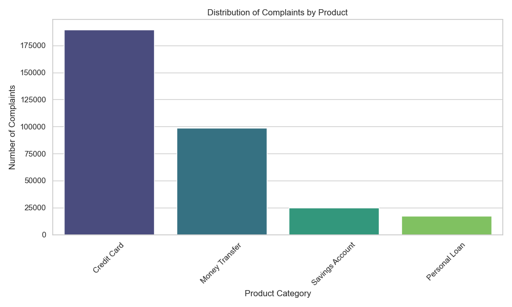
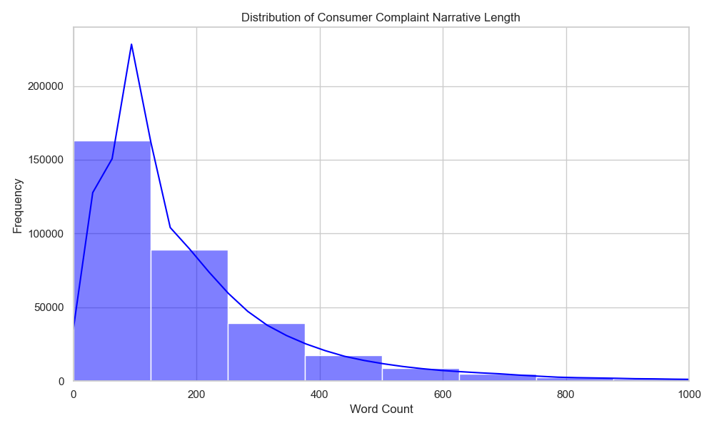
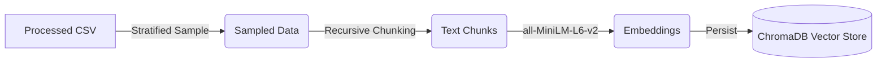

# Interim Report - Intelligent Complaint Analysis

## Task 1: Exploratory Data Analysis (EDA) and Preprocessing

### Objective
The goal was to filter the massive CFPB complaint dataset to focus on 4 key financial products and prepare the text for the RAG pipeline.

### Methodology
1.  **Filtering**: selected complaints belonging to 'Credit Card', 'Personal Loan', 'Savings Account', and 'Money Transfer'.
2.  **Cleaning**: Removed records with missing narratives. Normalized text (lowercasing).
3.  **Processing**: Saved the clean dataset to `data/filtered_complaints.csv`.

### Key Findings
-   **Volume**: Reduced the dataset from ~9.6 million raw records to **330,008** high-quality records with narratives.
-   **Distribution**:
    -   **Credit Cards** dominate the dataset (189k records), suggesting this will be the most query-rich category.
    -   **Money Transfers** follow with 98k.
    -   **Savings** (24k) and **Personal Loans** (17k) have smaller but sufficient volumes for RAG.
-   **Text Length**:
    -   Average complaint length is ~196 words.
    -   The distribution is right-skewed, with some complaints exceeding 6000 words. This confirms the need for **chunking** in Task 2 to fit within the embedding model's context window.

### Visualizations

*Figure 1: Distribution of complaints across the four target product categories.*


*Figure 2: Distribution of narrative lengths (truncated at 1000 words for visibility).*

## Task 2: Text Chunking, Embedding, and Vector Store Indexing

### Architecture
The following diagram illustrates the pipeline implemented in Task 2:



### Chunking and Embedding Strategy
-   **Sampling**: A stratified sample of **10,000 complaints** was created to ensure balanced representation across the 4 categories relative to their original distribution.
-   **Chunking**: Used `RecursiveCharacterTextSplitter` with:
    -   `chunk_size`: 500 characters
    -   `chunk_overlap`: 50 characters
    -   This size balances context preservation with the retrieval of focused segments.
-   **Embedding Model**: `sentence-transformers/all-MiniLM-L6-v2`.
    -   Selected for its speed and efficient performance (384 dimensions) suitable for local CPU execution.
-   **Vector Store**: **ChromaDB** was used to persist the embeddings locally.

### Key Results
-   Successfully indexed **27,143 chunks** (from 10,000 documents).
-   **Verification**: A test query "credit card late fee" successfully retrieved relevant complaint narratives from the vector store, confirming the pipeline's functionality.

### Verification Evidence (Terminal Output)
```text
Loading Vector Store from vector_store...
Total documents in store: 27143

Test Query: 'credit card late fee'

Result 1:
Content: i was charged a late fee plus interest for a previous balance that was paid off in full by the due date...
Metadata: {'Category': 'Credit Card', 'Product': 'Credit card'}

Result 2:
Content: i paid my credit card bill on xx/xx/2024. i was charged a late fee of $35.00...
Metadata: {'Category': 'Credit Card', 'Product': 'Credit card'}
```

### Next Steps
-   Proceed to Task 3: Building the RAG Pipeline (Retriever + Generator).
